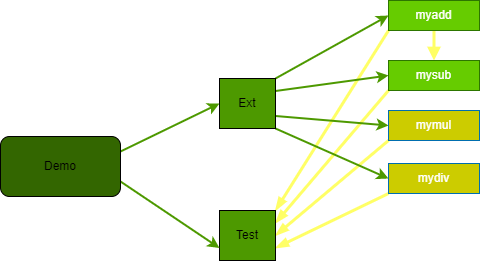
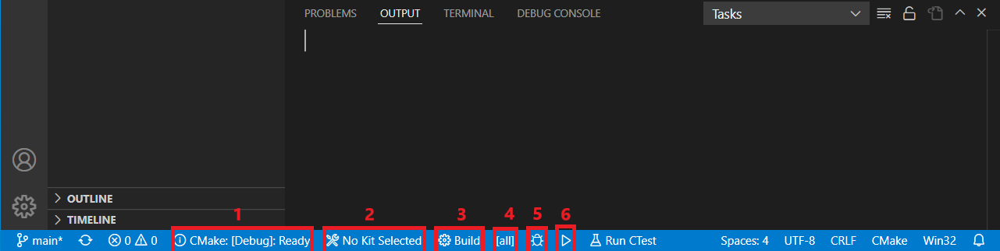
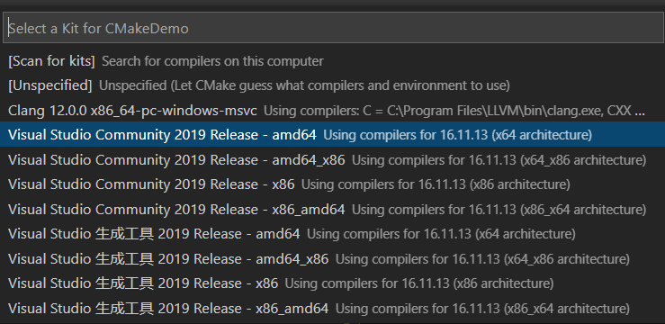

## Demo

#### Why Do This
- For Myself
  - 了解CMake的使用，便于在使用C/C++库的时候自行定制
  - 尝试用CMake组织略微复杂的工程
  - 记录自己常用的 **CMake** 命令
- For You
  - 需要快速上手 **CMake** 但是不想看复杂的内部实现
  - 需要快速了解一些常见 **CMake** 命令是如何用起来的
  - 想尝试CMake但是懒得找其他教程
  
#### What You Need To Know
- What You Will Learn
  -  **CMake** 常用命令解释与使用
- Basic Structure
  - Demo工程由两个部分组成：Ext项目(外部库)，以及Test项目(测试项目)
  - Ext项目由四个基本库组成：myadd, mysub, mymul, mydiv。前面两个是静态库，后面两个是动态库。其中，mysub的实现依赖于myadd
  - Test项目依次调用四个库，并输出正确结果
  
  
  &emsp;&emsp;&emsp;&emsp;&emsp;&emsp;&emsp;项目结构图（作图工具：vscode插件draw.io）  

#### How To Do
- Preparation
  - 工具：Windows系统及Visual Studio(最好2019，暂未测试其他版本)，CMake 3.23.x，Python
  - 技能：知道如何使用Visual Studio简单调试代码
- Run The Project
  - Method 1: **cmake-gui**
    - 1.打开cmake-gui,将"Where is the source code" 设置为本项目的根目录，将"Where to build the binaries"设置为 "本项目根目录/out"
    - 2.点击Configure，输出"Configure Done"后，再点击"Generate"，输"Generating Done"后,点击"Open Project"
    - 3.进入vs后，在"ALL"目录下的"INSTALL"项目处右键选择生成(build)，然后将"Test"目录下的"test"设为启动项目，后续即为Visual Studio正常调试代码操作
    - 4.That` all

  - Method 2: **powershell**/**cmd**
    - 1.打开powershell/cmd, cd进入到工程所在根目录
    - 2.输入命令
      ``` powershell
      mkdir out; cd out; cmake ..
      ```
    - 3.在out目录下找到Demo.sln, 用vs打开，后续步骤同"Method 1"的步骤3和4

  - Method 3: **vscode(推荐方式)**
    - 1.在vscode中安装"CMake","CMake-Tools"两个插件,并重新打开vscode
    - 2.找到本项目并打开，在底部有如下CMake插件的状态栏信息(若无，关闭vscode并重新打开)
    
    &emsp;&emsp;&emsp;&emsp;&emsp;&emsp;&emsp;&emsp;&emsp;&emsp;&emsp;&emsp;&emsp;&emsp;cmake插件
    - 3.设置模式为Debug(图标1)，Kit(图标2)选择默认的64位(下图为笔者电脑的配置), 项目target(图标4)选择install。然后生成生成项目(图标3)。若失败，可打开根目录的CMakelists.txt，并按下ctrl+s保存，再重复该步骤
    
    - 4.若在vscode中调试代码，点击debug(图标5)，选择名为test的项目
    - 5.若在vs中调试代码，操作步骤同"Method 2"的步骤2
> **注**：读者可自行体验vscode的cmake插件，在处理中小型项目比较方便。缺点是，调试功能比较弱，无法像Visual Studio一样查看代码执行时间，以及程序内存占用情况等。

-  Learn CMake
   - 1.阅读根目录下CMakeLists.txt文件：工程的基本设置，以及如何使用自定义cmake模块
   - 2.阅读src/ext及四个子目录下的CMakeLists.txt文件：自定义库的组织及使用
   - 3.阅读src/test目录下的CMakeLists.txt文件：可执行程序的构建，后面的注释部分会涉及CMake一些基本的命令用法
> **注**：将教程主体放到test目录下的CMake文件中而不放在Readme，主要是方便读者可以自己测试相关功能。如果读者有补充内容也可以放到该文件中，便于快速验证想法。另外推荐vscode是因为，每次编辑CMake文件，ctrl+s保存后，cmake会自动更新输出文档，输出结果，比较便捷。
